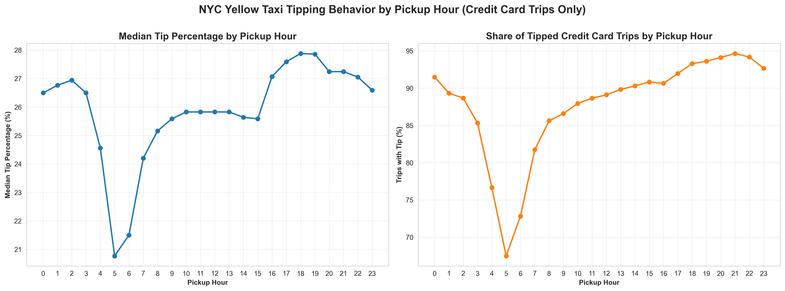
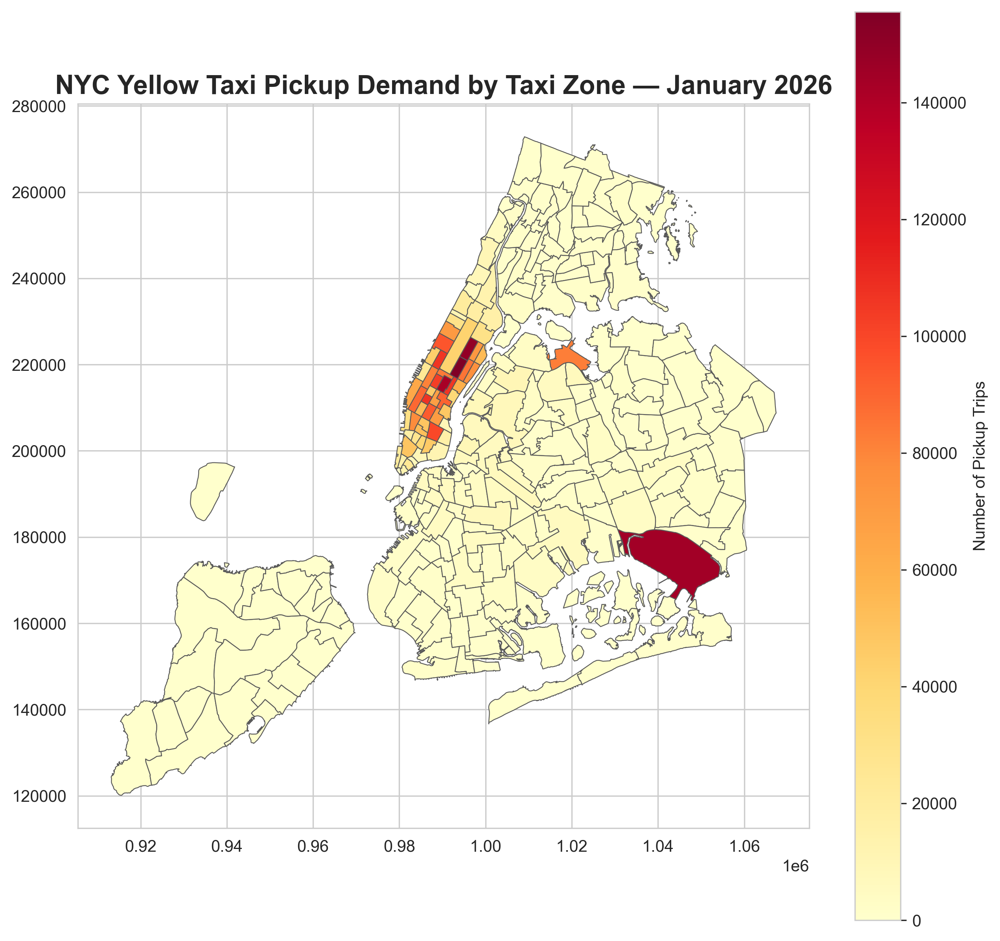
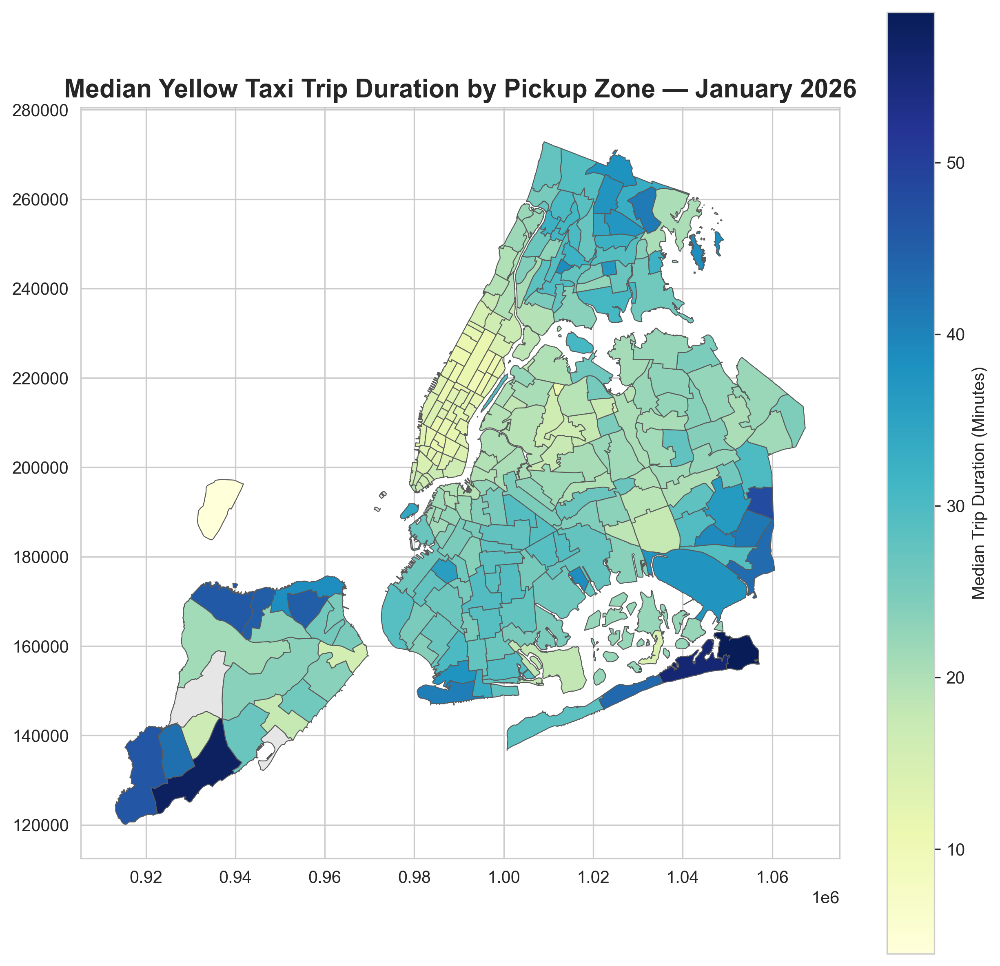
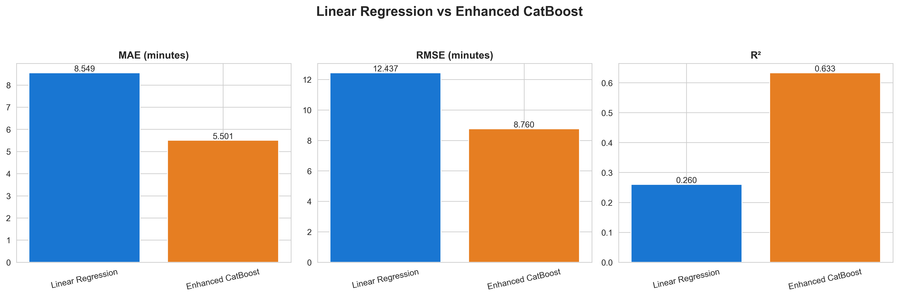

# 🚕 NYC Yellow Taxi Trip Analysis — January 2026

End-to-end exploratory data analysis, geospatial visualization, and machine learning case study on **3.7 million** NYC Yellow Taxi trip records from January 2026.

---

## 📌 Project Highlights

- **3,724,889** raw trip records analyzed to uncover temporal, spatial, and financial patterns.
- **Geospatial Insights**: 3 detailed choropleth maps tracking pickup demand, dropoff demand, and median trip durations across NYC.
- **Machine Learning Case Study**: Developed a leakage-aware trip-duration prediction model using CatBoost.
- **Comprehensive Analysis**: 14 distinct EDA sub-analyses covering everything from traffic patterns to tipping behavior.
- **Bilingual Documentation**: Extensive dataset and methodology documentation in English & Bahasa Indonesia.

---

## 💼 Business Questions & Objective

This portfolio project answers critical business questions for fleet management and urban mobility planning:
- When and where is taxi demand highest?
- How do travel speeds and trip durations vary across different times of day and boroughs?
- What are the typical tipping behaviors and payment preferences?
- **Model Objective**: Can we accurately estimate trip duration using only pre-trip information (e.g., pickup time, location, and geographic distance proxy) without relying on live traffic or routing data?

---

## 📊 Data Source and Scope

> **Data Source:** [NYC Taxi & Limousine Commission (TLC) Trip Record Data](https://www.nyc.gov/site/tlc/about/tlc-trip-record-data.page)

- **Dataset**: Yellow Taxi Trip Records — January 2026.
- **Scope**: The analysis is restricted to a single winter month (January 2026).
- **Limitations**: 
  - Findings do not represent other seasons (e.g., summer tourism) or other mobility options (e.g., subway, rideshare).
  - The ML model is an illustrative pre-trip duration estimator, **not** a production-ready ETA system. It does not use live traffic, weather, exact driving routes, or event data.
  - The EDA uncovers correlations and patterns but does not claim causal relationships.

---

## 🔬 Methodology

1. **Data Cleaning**: Handled missing values, removed outliers (e.g., extreme speeds, zero-passenger trips), and engineered temporal/geospatial features.
2. **Exploratory Data Analysis**: Visualized demand distributions, pricing, and tipping using Matplotlib and Seaborn.
3. **Geospatial Mapping**: Joined TLC trip data with Taxi Zone shapefiles via GeoPandas to visualize spatial trends.
4. **Machine Learning Pipeline**:
   - Implemented a rigorous **time-based split**: Training data before Jan 25, 2026, and a future holdout test set starting Jan 25, 2026.
   - Prevented **data leakage**: Excluded post-trip features like `fare_amount`, `tip_amount`, and actual `trip_distance` from the model inputs.
   - Built a median baseline, a Linear Regression model, and an enhanced CatBoost model utilizing an estimated geographic (centroid-to-centroid) distance proxy.
   - Utilized a chronological validation split on historical data for early stopping to respect temporal ordering.

---

## 🔍 Key Findings (EDA)

| Finding | Detail |
|---|---|
| **Peak demand** | ~6 PM daily; Saturday is the busiest day. |
| **Manhattan dominance** | 3.1M+ trips start *and* end in Manhattan. |
| **Short local trips** | 85% of trips stay within the same borough (median 1.56 mi). |
| **Interborough trips** | Only 15% of trips, but median distance 9.33 mi & median fare ~$55. |
| **Traffic pattern** | Fastest speeds at 3–5 AM; slowest during daytime congestion. |
| **Payment & Tipping** | Credit card dominates (~61%); tipping is lowest at 4–6 AM and highest in the evening. |

---

## 📈 Machine Learning Results

### Final Model Comparison
| Model | MAE (min) | RMSE (min) | R² |
|---|---|---|---|
| Baseline (Median) | 9.070 | 14.542 | -0.065 |
| Linear Regression | 8.549 | 12.437 | 0.260 |
| **Enhanced CatBoost** ✅ | **5.501** | **8.760** | **0.633** |

*CatBoost was selected as the final model because it substantially outperformed both the naive baseline and Linear Regression on the future time holdout.*

---

## 🖼️ Visualizations

<p align="center">
  
</p>
<p align="center">
  
</p>
<p align="center">
  
  
</p>
<p align="center">
  
</p>

---

## 🗂️ Project Structure

```
Yellow_taxi_tripdata_NYCD/
│
├── main.ipynb                    # Main analysis notebook (Data Prep, EDA, ML)
├── Dataset_explanation.md        # Detailed dataset & column documentation (EN/ID)
├── taxi_zone_exp.md              # Taxi Zone lookup table documentation (EN/ID)
├── README.md                     # Project overview and methodology
├── requirements.txt              # Python dependencies
├── .gitignore
├── LICENSE                       # MIT License
│
├── data/                         # (git-ignored) Raw data and shapefiles
├── img/                          # Exported visualizations (EDA, geospatial, ML)
└── models/                       # Saved trained models (.pkl)
```

---

## 🚀 Run Locally

### 1. Clone the repository
```bash
git clone https://github.com/<your-username>/Yellow_taxi_tripdata_NYCD.git
cd Yellow_taxi_tripdata_NYCD
```

### 2. Install dependencies
Ensure you have Python 3.11+ installed.
```bash
pip install -r requirements.txt
```

### 3. Download the dataset
Download the **Yellow Taxi Trip Records — January 2026** (Parquet format) from the [NYC TLC website](https://www.nyc.gov/site/tlc/about/tlc-trip-record-data.page) and place it in the `data/` folder:
```
data/yellow_tripdata_2026-01.parquet
```

### 4. Run the notebook
```bash
jupyter notebook main.ipynb
```
*(If you encounter resource constraints, you can execute it sequentially via command line: `python -m jupyter nbconvert --execute --to notebook --inplace main.ipynb`)*

---

## 🌟 Portfolio Value

This project demonstrates practical Data Analyst and Machine Learning skills:
- Handling large datasets (~3.7M rows) with Pandas.
- Translating raw geographic data into actionable geospatial insights (GeoPandas).
- Structuring a rigorous, leakage-free machine learning problem.
- Evaluating model performance robustly with chronological holdouts and segment-based error analysis.
- Communicating findings clearly for business stakeholders.

---

## 📜 License

This project uses publicly available data from the [NYC Taxi & Limousine Commission](https://www.nyc.gov/site/tlc/about/tlc-trip-record-data.page). The analysis code is open-sourced under the MIT License for educational and portfolio purposes.
