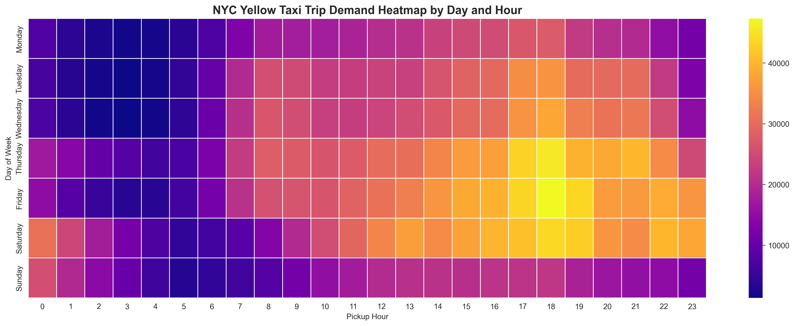
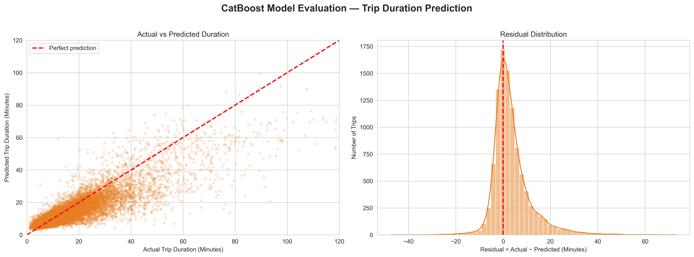

# 🚕 NYC Yellow Taxi: Big Data Analytics & Trip Duration Predictor

This repository contains a comprehensive Big Data analysis of over **3.7 million** NYC Yellow Taxi trip records (January 2026). The project encompasses Data Engineering, Exploratory Data Analysis (EDA), Statistical Hypothesis Testing, Machine Learning modeling, and an interactive Streamlit Dashboard optimized for large-scale data rendering.

---

## 📊 Project Overview & Big Data Handling

Analyzing millions of geographical data points presents significant computational challenges. This project demonstrates proficiency in handling such datasets by leveraging robust `pandas` aggregation techniques, ensuring that the final interactive `Streamlit` dashboard remains highly performant without causing browser memory exhaustion (OOM).

### 💡 Key Findings
* **The Manhattan Monopoly:** The vast majority of taxi demand is hyper-concentrated in Manhattan, with trips both originating and ending within the borough dominating the dataset.
* **Tipping Psychology:** A Mann-Whitney U test statistically proves ($p < 0.05$) that passengers paying via Credit Card tip significantly higher than those paying with Cash.
* **Predictive Modeling:** A `CatBoost` Regression model was deployed to predict trip duration (in minutes) based on pickup location, dropoff location, trip distance, day, and hour. The model successfully navigates the complex temporal and spatial features of NYC traffic.

---

## 📸 Analytical Highlights

<p align="center">
  <br>
  <em>Heatmap showing peak taxi demand occurs during Thursday and Friday evenings.</em>
</p>

<p align="center">
  <br>
  <em>Residuals and Actual vs Predicted plots for the CatBoost Trip Duration model.</em>
</p>

---

## 🗂️ Project Structure

```text
├── data/                                      # Dataset (Parquet) and zone lookup tables
├── img/                                       # Exported high-resolution visual plots
│   ├── EDA/                                   # Exploratory Data Analysis graphs
│   ├── ML/                                    # Machine Learning validation graphs
│   ├── distribution/                          # Feature distribution graphs
│   └── geospatial/                            # NYC map rendering plots
├── models/                                    # Pickled Machine Learning models (.pkl)
├── main.ipynb                                 # Complete Notebook for EDA & Modeling
├── app.py                                     # High-performance Streamlit Dashboard
├── Dataset_explanation.md                     # Schema definitions
└── README.md                                  # Project documentation
```

---

## 🚀 How to Run the Dashboard

### 1. Prerequisites
Ensure you have Python 3.9+ installed and that the `yellow_tripdata_2026-01.parquet` file is located in the `data/` directory.

### 2. Installation
Install the required dependencies using pip:
```bash
pip install streamlit pandas numpy plotly joblib pyarrow scikit-learn
```

### 3. Running the Dashboard
Launch the interactive Streamlit application (it utilizes `st.cache_data` and pre-aggregation to ensure fast loading times):
```bash
streamlit run app.py
```
